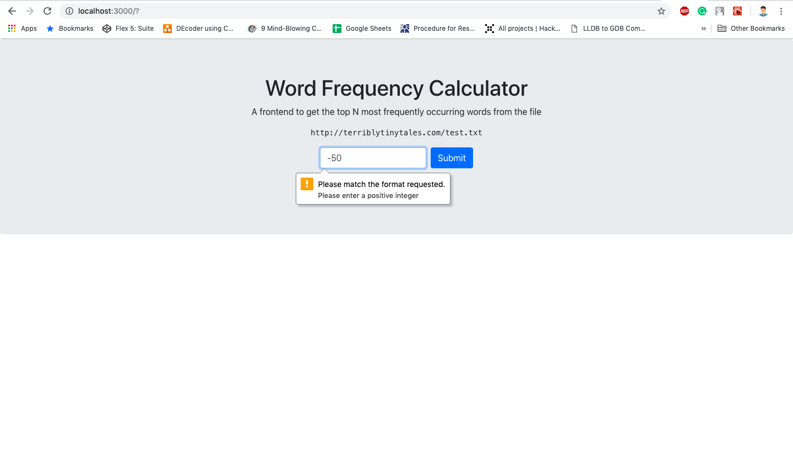
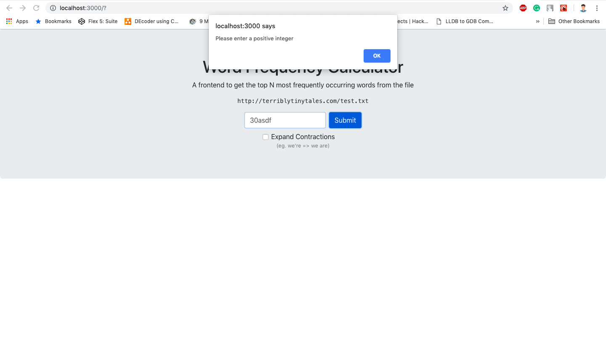
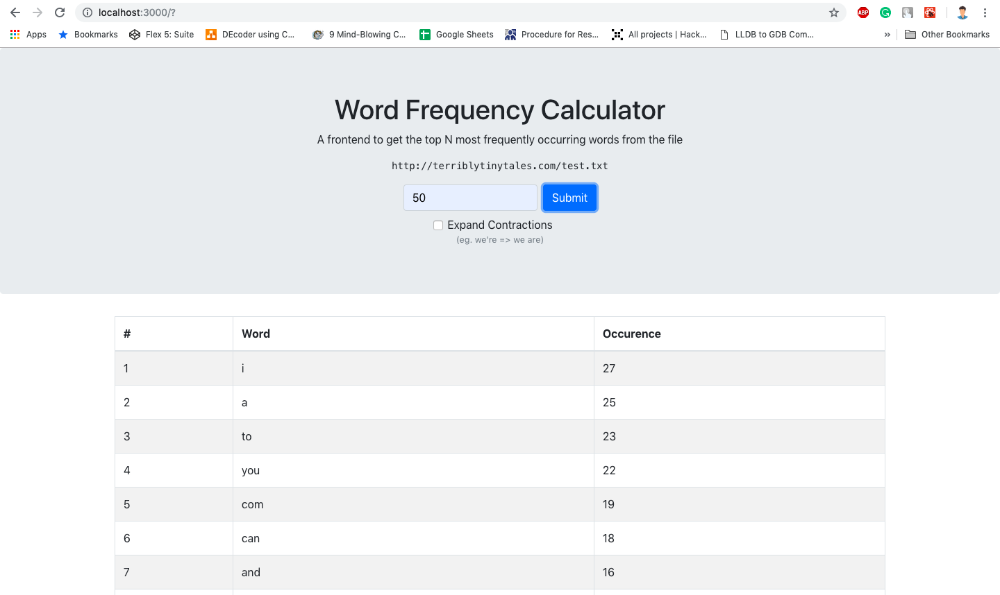
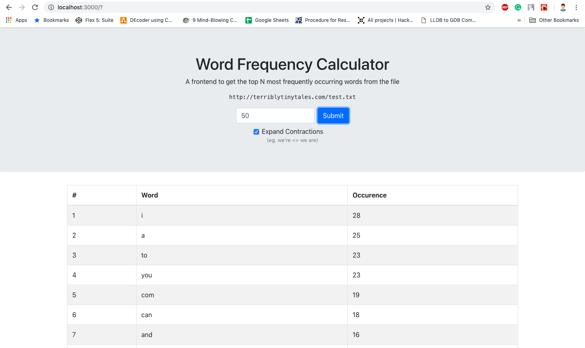

This project is bootstrapped with Create React App and Express.js

## Available Scripts

In the project directory, you can run:

### `npm run dev`

Runs the app in the development mode. 
Open [http://localhost:3000](http://localhost:3000) to view it in the browser.

npm's `concurrently` package is used to run both frontend and backend simultaneously
You can get the code under the **scripts** section of `package.json`

## Demo of word frequency counter
Open [http://139.59.12.178/ttt](http://139.59.12.178/ttt)

## Code Components

Under `/src` directory, you will find the fronend in `App.js` file. 
Under `/scripts/server.js`, you will get nodejs, expressjs initial settings. 
Under `/src/server` directory, you will find all the API routes in `router.js` file & APIs in the controller `apiController.js` file.

### Frontend: App.js

**NPM packages used**
* **axios**: To fetch the api

In App.js, _handleSubmitFC_ validates the inputs and then makes a post request to the backend using axios.
After this, the top N words and their frequency of occurrence diplays in the frontend, in a tabular format.

For detailed explaination please go through the comments in the App.js file.

### Backend: routes.js

**NPM packages used**
* **express**: NodeJS framework

In routes.js, you will get routes of all the apis

### Backend: apiController.js

**NPM packages used**
* **request**: To fetch files from remote server
* **contractions**: To expand the contractions. eg. `we're = we are, ma'am = madam`
* **url-exists**: To check if the remote file exists

**Execution:**
1. Api validates the inputs, then it fetches the file from remote server.
2. Clean the text of the file by replacing curly apostrophes with simple ones.
3. Expand all the contractions, if required by user to get accurate results.
4. Match the text with the pattern `/['\w]*[^\d\W]+/gi` and store all the valid words in an array.
5. Count word frequency.
6. Sort the words array in descending order.
7. Send required output.

## Test Cases

**1 Pattern validation of input: HTML level**
 

**2 Pattern validation of input: Javascript level before post request**
 

**3 Check if file exists: Before feching the remote file using _url-exists_**
 

**4 All good: Without expanding the contractions**
 

**5 All good: With expanding the contractions**
 

`NOTE: PLEASE GO THROUGH THE COMMENTS IN THE CODE FILES FOR DETAILED EXPLAINATION`
